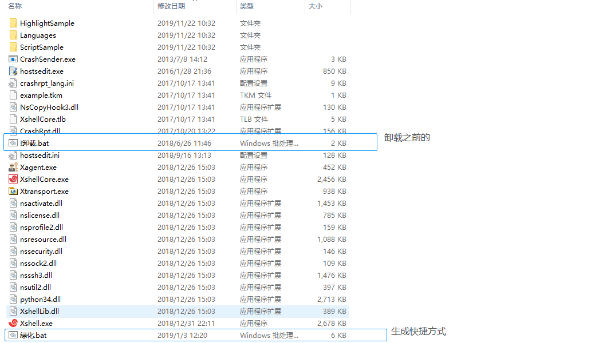

# xshell6破解版亲测可行 附xftp6

在使用xshell的时候总会遇见下面的问题，而且有时候会丢失以前保存的内容，很烦

- 要继续使用此程序,您必须应用最新的更新
- 需要更新应用

用了一段时间下面这个破解版，还算稳定

本来想上传csdn，没想到违规了，如果需要的话还是到我网盘下吧，

链接：https://pan.baidu.com/s/1u-pOZJpBUyn9ptS_jc1LQA 
提取码：wkf1

## 使用方法

下载之后有直接解压到相应目录

执行下面的操作，xshell和xftp的都是一样的操作，忽略报错信息

如果上面不可用的话，请联系下面

 https://ddssingsong.github.io/about/ 